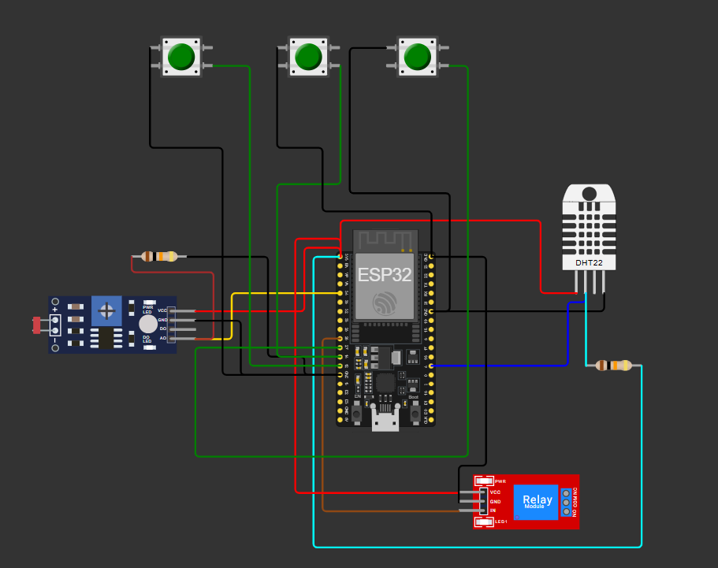
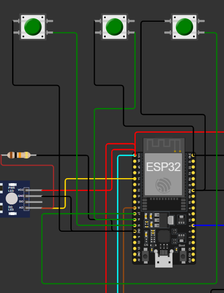
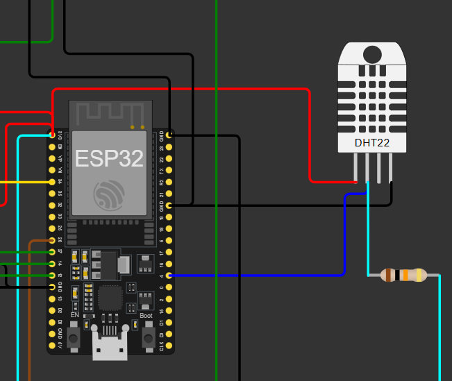
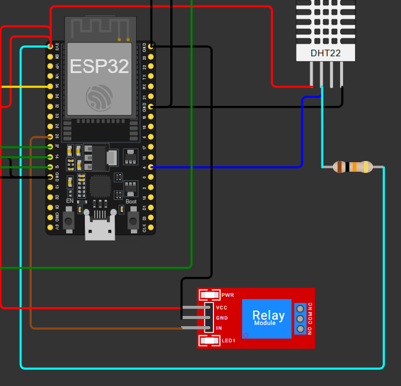
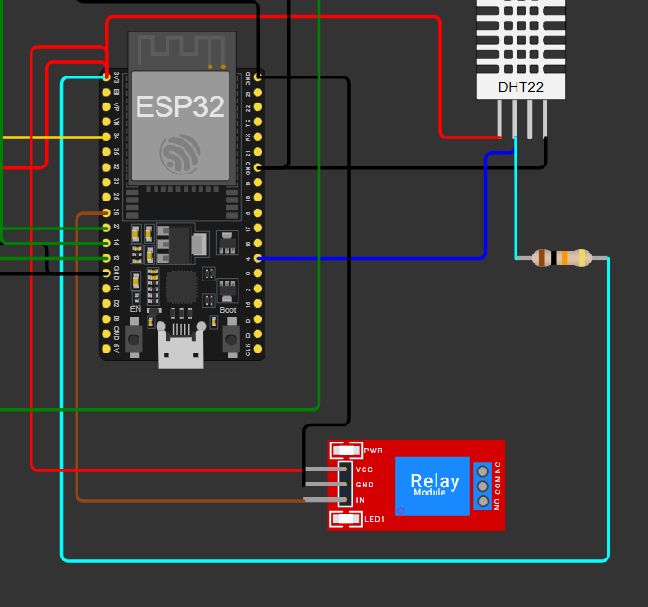
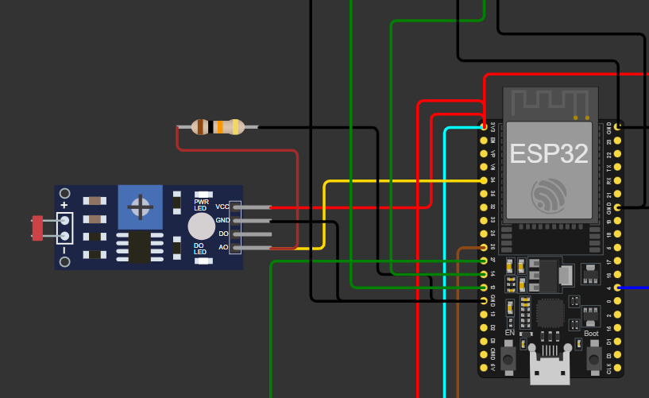

# FIAP - Faculdade de Informática e Administração Paulista

 

# Projeto ESP32

## 👨‍🎓 Aluna: 
- <a href="https://www.linkedin.com/company/inova-fusca">Mariana Carvalho Youn (RM568548)</a>

## 👩‍🏫 Professores:
### Tutor(a) 
- <a href="https://www.linkedin.com/company/inova-fusca">Sabrina Otoni</a>
### Coordenador(a)
- <a href="https://www.linkedin.com/company/inova-fusca">André Godoi Chiovato</a>

## 📜 Descrição

O presente projeto tem como objetivo o **desenvolvimento de um sistema embarcado utilizando a plataforma ESP32**, com sensores conectados e monitorados por meio da simulação no **Wokwi.com**.  
O projeto visa demonstrar a integração entre **hardware e software** através do uso de sensores de temperatura, umidade e botões, controlando saídas como LEDs e exibindo informações coletadas.

A lógica principal foi implementada em **C++**, utilizando o **framework Arduino** dentro do ambiente **PlatformIO**, garantindo escalabilidade e clareza no código-fonte.

## 📁 Estrutura de pastas

Dentre os arquivos e pastas presentes na raiz do projeto, definem-se:

MEUPROJESP32/
│
├── src/
│ └── main.cpp: Código principal do projeto
│
├── imagem/: Imagens do circuito e demonstrações do projeto
│
├── diagram.json: Arquivo de configuração do circuito no Wokwi
│
├── platformio.ini: Configurações da plataforma ESP32
│
├── wokwi.toml: Arquivo de simulação da ferramenta Wokwi
│
├── linkyoutube.txt: Arquivo do link do Youtube sobre o funcionamento do projeto
│
└── README.MD: Documento de explicação do projeto

## 🔧 Como executar o código

O sistema desenvolvido é baseado no controle de sensores e atuadores conectados ao ESP32.

🔸 Sensores e Atuadores Utilizados:
- **DHT22:** Sensor responsável pela medição da temperatura e umidade do ambiente.  
- **LDR:** Sensor responsável pela medição da luminosidade (ph) do ambiente.
- **Botões:** Utilizados para interação com o sistema, podendo acionar LEDs ou funções específicas.  
- **RELÉ/LEDs:** Indicador visuais do estado do sistema ou resultado das leituras dos sensores.

---

🧠 Lógica de Funcionamento:

1. O código inicializa o sensor DHT, os pinos de entrada (botões) e saída (LEDs); 
2. O ESP32 lê os valores de **temperatura**, **umidade** e **luminosidade** em intervalos regulares;  
3. Dependendo do valor lido: -> se a umidade < 50%; se algum botão N, P, K for pressionado; se o LDR (pH) ficar fora da faixa 5.5–7.5;
4. Os botões permitem alternar o comportamento dos LEDs e reiniciar as medições;  
5. Todas as informações são registradas e podem ser exibidas via monitor serial.

---

🔌 Esquema do Circuito no Wokwi:

O circuito foi montado utilizando a plataforma [Wokwi](https://wokwi.com/), conectando todos os componentes de forma lógica e funcional.

---

💡 Diagrama e Conexões: 

A seguir imagens que mostram as conexões entre o ESP32, o sensor DHT22, o LDR, o RELÉ, os botões e os restantes dos componentes, conforme definido no arquivo diagram.json.

</a>
</a>
</a>
</a>
</a>
</a>

▶️ Como Executar o Código:
1 - Abra o projeto no VS Code com o plugin PlatformIO instalado.
2 - Conecte o ESP32 à sua máquina via USB.
3 - Clique em Build (✔) para compilar o código.
4 - Clique em Upload (→) para enviar o firmware ao ESP32.
5 - Para testar sem o hardware, utilize a simulação do Wokwi: Acesse o arquivo wokwi.toml e inicie a simulação.
6 - Verifique os resultados no terminal serial ou na interface visual da plataforma.

## 🗃 Histórico de lançamentos

* 1.0	- 15/10/2025 -> Versão inicial do projeto, código e simulação no Wokwi.
    * 
* 1.1 - --/--/---- -> Implementação de melhorias e documentação final.
    * 
